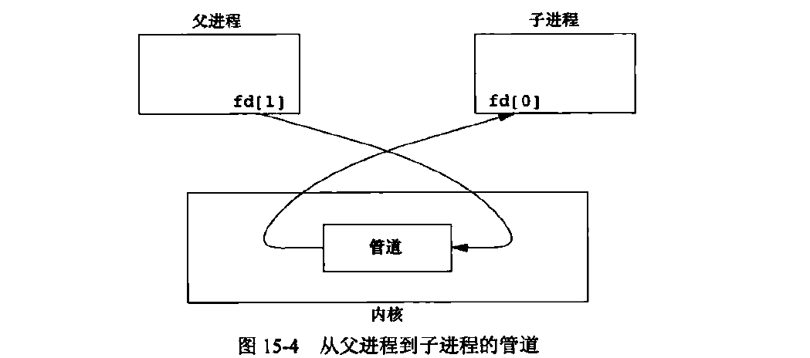
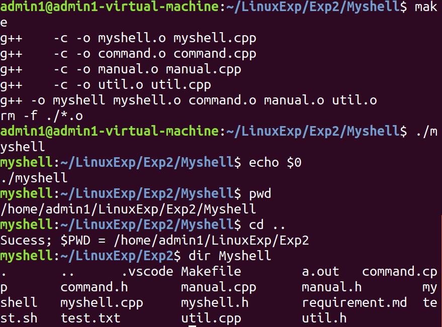
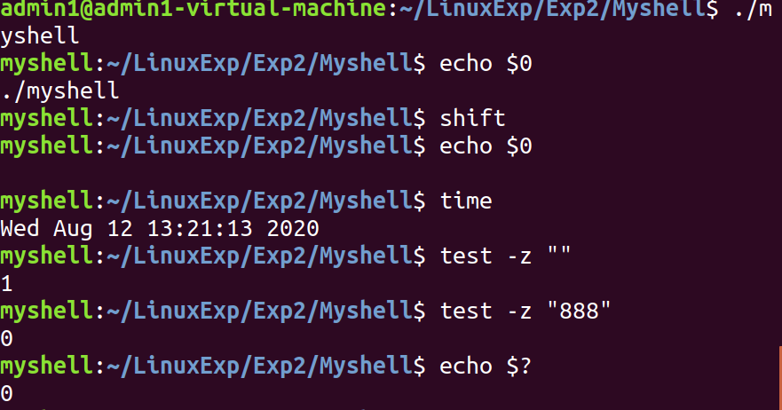
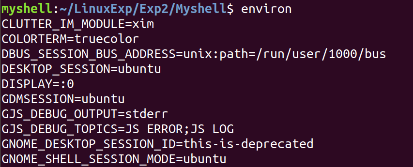
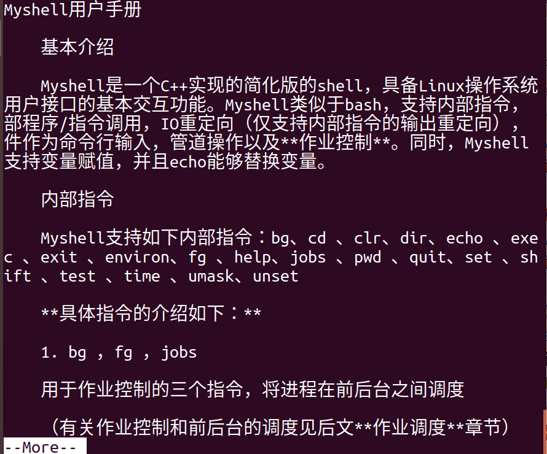
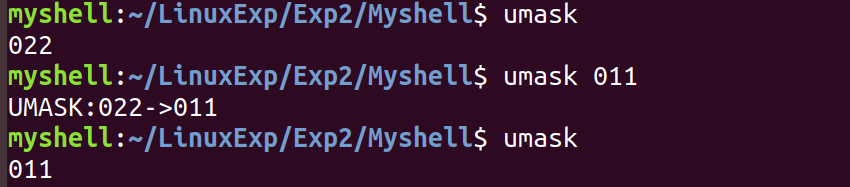
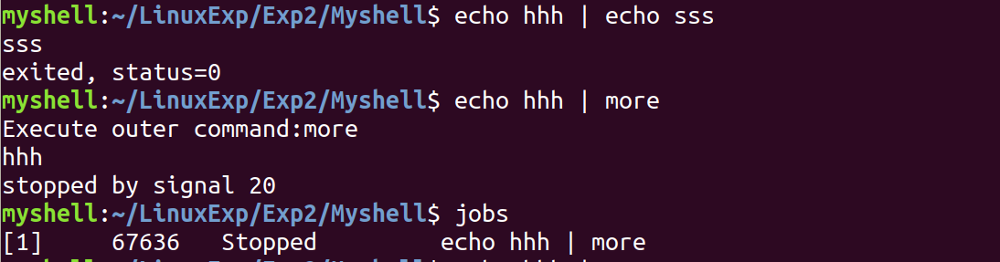
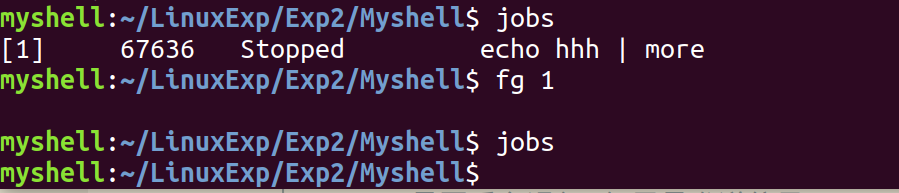
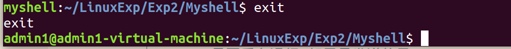

# Myshell用户手册

### 基本介绍

Myshell是一个C++实现的简化版的shell，具备Linux操作系统用户接口的基本交互功能。Myshell类似于bash，支持内部指令，外部程序/指令调用，IO重定向（仅支持内部指令的输出重定向），文件作为命令行输入，管道操作以及**作业控制**。同时，Myshell还支持变量赋值，并且echo能够替换变量。

### 内部指令

Myshell支持如下内部指令：bg、cd 、clr、dir、echo 、exec 、exit 、environ、fg 、help、jobs 、pwd 、quit、set 、shift 、test 、time 、umask、unset

**具体指令的介绍如下：**

1. bg ，fg ，jobs

   用于作业控制的三个指令，将进程在前后台之间调度

   （有关作业控制和前后台的调度见后文**作业调度**章节）

   **bg** \<command> 后台运行某个指令
   
   **jobs** 用于列举所有还放在后台的指令

   **fg** \<jobno> 用于将后台的指令（编号为jobno的后台指令）转到前台

2. cd, pwd

   **cd** \<pathname>指令用于转换工作目录，当前工作目录会显示在命令提示符上

   **pwd** 用于输出当前工作目录

3. clr 

   清屏并将光标移到左上角

4. dir \<directory>

   列出某一个文件夹中的所有文件

5. echo \<string>

   显示字符串，**支持字符串替换** 

6. exec \<command>

   运行一个程序后（替换当前的进程）并退出Myshell

7. exit, quit

   退出Myshell

8. environ, set

   这两个指令用于显示环境变量和用户定义的变量

   其中**environ** 只显示环境变量，**set** 既显示环境变量又显示用户定义的变量。

   这里的环境变量指的是**进程环境/程序环境**中的环境变量，是由Linux内核管理控制的，并提供了编程接口让程序（myshell）能过管理这些环境变量。

9. unset \<variable>

   清除用户变量或环境变量的定义

10. help

    显示用户帮助手册并用**more** 作为pager过滤

11. shift [N]

    将参数移动N位，仅在以文件为输入时有意义

    当不输入N时，默认移动一位

12. test \<expression>

    测试后面跟着的待测表达式是真或假，待测表达式

    支持的表达式包括：

    1. -z 是否为空给
    2. -d 是否为文件夹
    3. -eq 二者是否相等
    4. -ne 二者是否不等

13. time

    输出当前时间比如：Tue Aug 11 19:57:59 2020

14. umask

    设置umask（建立文件时预设的权限掩码。）

    umask可用来设定**权限掩码**。**权限掩码**是由3个八进制的数字所组成，将现有的存取权限减掉权限掩码后，即可产生建立文件时预设的权限。

    

### 外部程序调用

Myshell支持外部程序或指令的调用，通过exec系列函数实现。

外部程序调用相当于在myshell程序内部运行别的程序。

这些外部指令包括ls，cat等等，只要该程序在PATH环境变量指定的路径下能被找到，就能被调用。

### IO重定向

Myshell支持输出的重定向，**包括内部和外部指令**。

其中`> <filename>`表示覆写该文件，如果该文件不存在则创建

而 `>> <filename>`表示在文件末尾加上该文件，如果该文件不存在则创建

### 文件作为命令行输入

当调用myshell时传入参数，第一个参数被认为是脚本文件

比如`myshell test.sh`

test.sh 中的内容每一行被当作一条指令顺序执行

而如果在文件名后还有后续参数，myshell将他们保存起来

作为第一、二.......个参数, 可以被echo引用

第零个参数是test.sh

### 管道操作

管道(pipe)是Linux支持的一种文件数据流动的一种特殊方式。管道一般用在两个进程间的通信。通过建立管道的方式，一个进程可以把输出链接到另一个进程的输入，从而实现单向（也可以是双向的，如果有两个管道的话）的进程通信。管道利用了Linux的文件描述符链接管道和两个进程。

### 作业控制

作业控制指的是Linux终端上对于前后台进程的切换和管理。

前台进程指的是拥有与用户交互的终端的标准输入输出权限的进程。而后台进程想要使用这个输入输出会产生其他信号SIGTTOU和SIGTTIN。在Myshell中后台进程都被暂停了，在转为前台后继续运行。在myshell（bash中也相同）中，内部指令是在与终端同一进程运行的，所以内部指令不会被转换为后台进程。

**Myshell与bash一样，屏蔽了一些信号，比如SIGTSTP。**

Myshell中支持：

1. 前台进程的Ctrl+Z暂停；
2. & 或bg命令后台运行进程（实际上进程被暂停）；
3. jobs查看后台（被暂停的）进程；
4. fg将后台的进程

### 示例

#### 文件夹相关

* dir
* cd
* pwd

#### 参数相关

* `$0`
* echo 
* shift
* test

#### 系统环境变量相关

#### 用户手册

* 通过`more`程序进行分页显示
* 利用了管道

#### umask 权限相关

#### 管道

#### 进程调度

* 支持前后台进程
* **[POSSIBLE BUG]**在与管道和more一起使用的时候可能会出现问题

